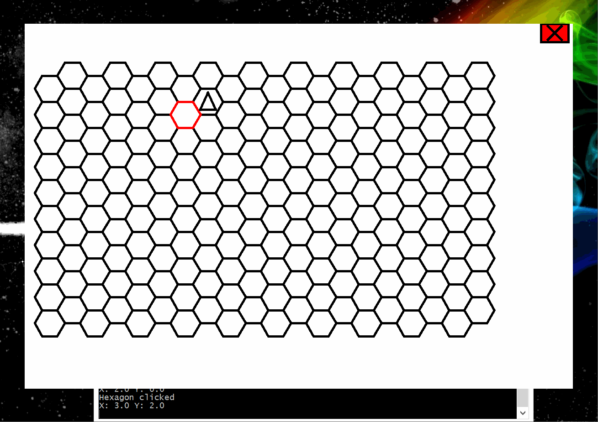

# Hex8
Hex8 will be a real time strategy game written in Java. Currently it is in very early development, and we have no idea when the first actual release will be. 

There will be four players per game. Red, Green, Blue, and Yellow. Each player will have their own special stat boost depending on the color they choose.

Red has a military focus, they gain an extra 20% of attack power.

Green hasn't been decided yet.

Blue has a science focus, they gain an extra 20% of research power.

Yellow has an economoic focus, they gain an extra 20% of economic power. (extra gold per turn)

